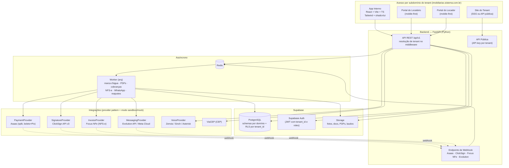
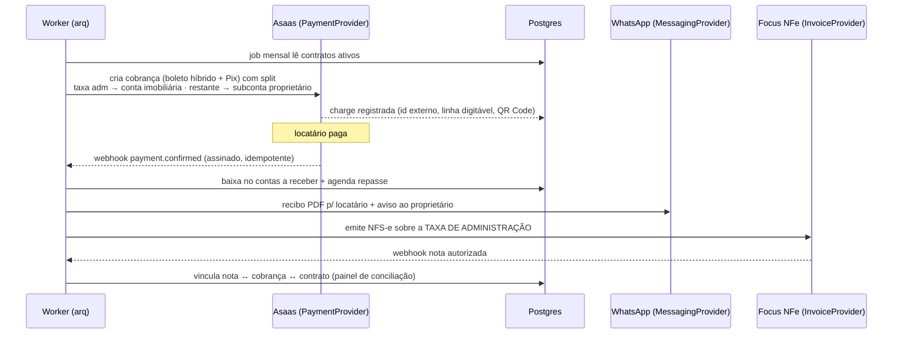

# Arquitetura do Sistema — SaaS de Gestão Imobiliária (Vendas + Locação)

> **Status:** proposta para aprovação (pré-Fase 1)
> **Referências de mercado estudadas:** Vista CRM, Jetimob, Kenlo, Superlógica Imobiliárias, Imoview, Arbo — funil imobiliário (captação → atendimento → visita → proposta → contrato), portais de locador/locatário e motor financeiro com repasse são os padrões que o setor espera.

---

## 1. Visão geral

Sistema multi-tenant white label para imobiliárias de 1 a 20 colaboradores, com dois módulos comercializáveis separadamente (**Locação** — implementação completa; **Vendas** — apenas casca nesta fase) sobre uma fundação comum (clientes, imóveis, financeiro central, RBAC, branding).



---

## 2. Multi-tenant e White Label

| Aspecto | Decisão |
|---|---|
| Isolamento | `tenant_id UUID` em todas as tabelas de negócio + **RLS no Postgres** (política por schema/tabela) |
| Resolução do tenant | Middleware FastAPI resolve pelo **subdomínio** (`Host` header) → `core.tenant_domains`; fallback por claim `tenant_id` no JWT |
| RLS na prática | Frontend acessa **somente via API** (não usa supabase-js direto contra tabelas de negócio). O backend abre a conexão e executa `SET LOCAL app.tenant_id = ...`; políticas RLS usam `current_setting('app.tenant_id')`. Supabase Auth continua emitindo os JWTs |
| Plano por tenant | `core.tenants.plan ∈ {venda, locacao, completo}` + flags em `core.tenant_modules`. Navegação, rotas e permissões são renderizadas condicionalmente — quem contrata só locação nunca vê menus de venda |
| White label | `core.tenant_branding`: logo (Storage), cores primária/secundária/acento, favicon, nome de exibição. Cores injetadas em runtime como **CSS variables** (tema shadcn). Logo aplicado no app, portais, PDFs e marca d'água das fotos |

---

## 3. Estrutura do repositório (monorepo)

```
CRM-Clemente/
├── apps/
│   ├── web/                  # React + Vite + TS (app interno + portais como rotas por papel)
│   └── api/                  # FastAPI
│       ├── app/
│       │   ├── core/         # config, tenancy, security, deps
│       │   ├── modules/      # routers/services por domínio (crm, properties, rentals, ...)
│       │   ├── providers/    # payment/, signature/, invoice/, messaging/, voice/ (base + impl + mock)
│       │   ├── workers/      # tasks arq (watermark, pdf, billing, nfse, whatsapp)
│       │   └── webhooks/     # handlers de webhook por provedor
│       └── tests/
├── supabase/
│   └── migrations/           # SQL versionado (schemas, RLS, seeds)
├── infra/
│   ├── docker-compose.yml    # api, worker, redis, caddy (VPS Ubuntu 24.04)
│   └── Caddyfile             # TLS automático + wildcard de subdomínio
├── docs/                     # este diretório
└── PROGRESS.md               # atualizado ao fim de cada fase
```

---

## 4. Fluxos críticos

### 4.1 Cobrança de aluguel com split (coração do módulo)



Regras tratadas no motor: multa e juros configuráveis, desconto por pontualidade, segunda via, baixa manual (pagamento por fora), descontos de manutenção abatidos do repasse com comprovante, extrato mensal de repasse ao proprietário.

### 4.2 Upload de foto com marca d'água

Upload → Storage (original privado) → job `watermark` (Pillow aplica logo do tenant) → grava versão marcada → vitrine/portais/API pública servem **apenas a versão marcada**.

### 4.3 Contrato + assinatura

Template com variáveis (partes, imóvel, valores, índice IGP-M/IPCA, vigência, garantia) → PDF → envelope ClickSign v3 → webhooks de status (visualizado/assinado/recusado) → documento assinado no Storage → disponível nos portais. Alertas de vencimento 90/60/30 dias e reajuste anual automático pelo índice contratado (tabela de índices alimentada por job).

---

## 5. Segurança

- RLS em todas as tabelas de negócio; testes automatizados de isolamento entre tenants.
- RBAC: papéis (Admin, Gestor, Corretor, Financeiro, Atendimento, Vistoriador, RH) × permissões granulares (ver/criar/editar/excluir/aprovar) por módulo.
- Log de auditoria (`core.audit_log`) para ações sensíveis: edição de contrato, estorno, exclusões.
- Webhooks: validação de assinatura do provedor + idempotência por `event_id`.
- API pública: API key por tenant com escopo somente-leitura de imóveis + captura de leads, rate limit.
- Segredos por ambiente via `.env` (nunca commitados); modo sandbox/mock para todos os provedores em dev.

---

## 6. Deploy

- **VPS Ubuntu 24.04** com Docker Compose: `api`, `worker`, `redis`, `caddy` (reverse proxy com TLS automático e wildcard `*.sistema.com.br`).
- Frontend pode ser servido pelo Caddy no VPS ou publicado na **Vercel** (mesma origem de API via subdomínio).
- Supabase gerenciado (banco, auth, storage) — sem estado no VPS além do Redis.

---

## 7. Fases de execução

| Fase | Entrega | Status |
|---|---|---|
| 0 | Arquitetura + ER + decisões (este documento) | ✅ aguardando aprovação |
| 1 | Fundação: multi-tenant, auth, RBAC, white label, clientes, imóveis (marca d'água), financeiro central básico | — |
| 2 | Locação core: CRM de locação, contratos + ClickSign, cobrança com split (Asaas sandbox), recibos | — |
| 3 | Financeiro avançado: NFS-e + conciliação, repasses, multas/juros/reajustes, relatórios do proprietário | — |
| 4 | Operação: chaves, vistorias com laudo PDF, chamados de manutenção | — |
| 5 | Atendimento: inbox WhatsApp, chatbot, indicadores, VoIP, CS e indicações | — |
| 6 | Portais (locatário/locador) e site/API pública | — |
| 7 | RH + casca do módulo Vendas | — |
