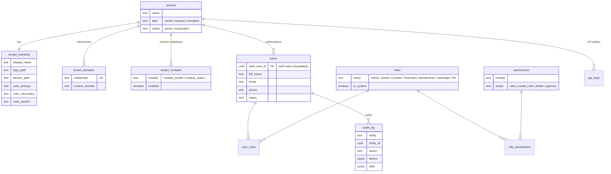
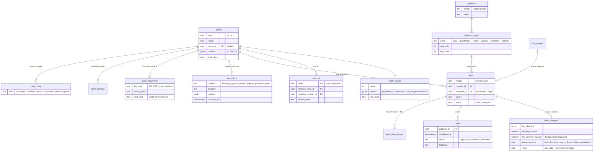
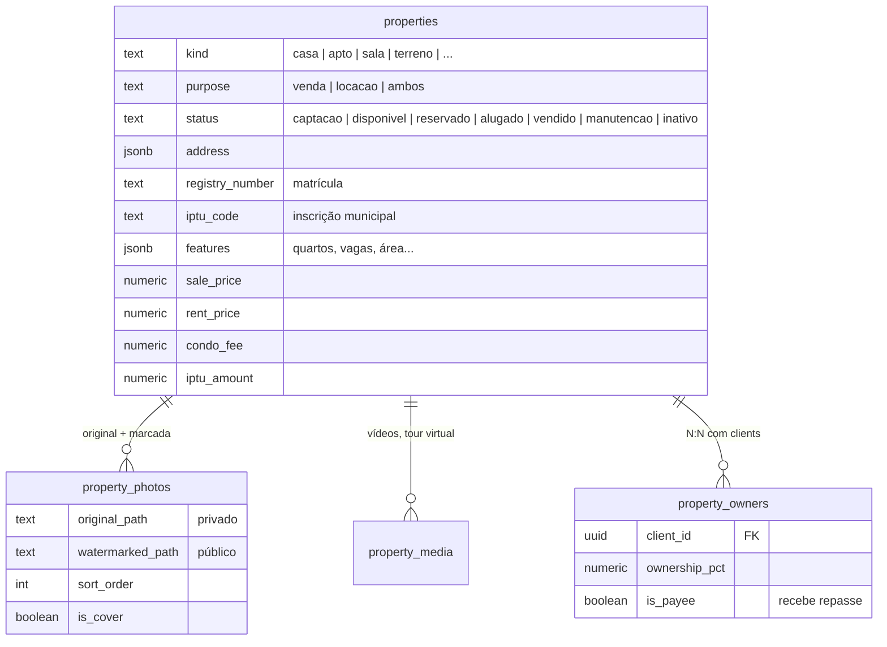
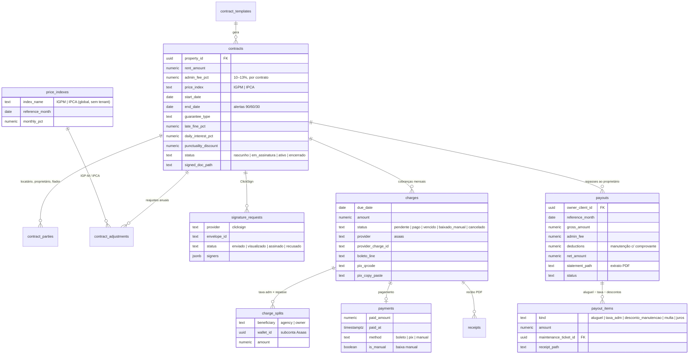
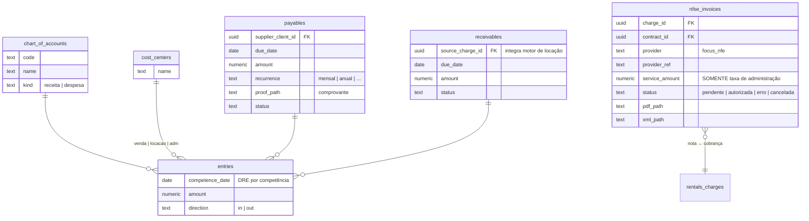
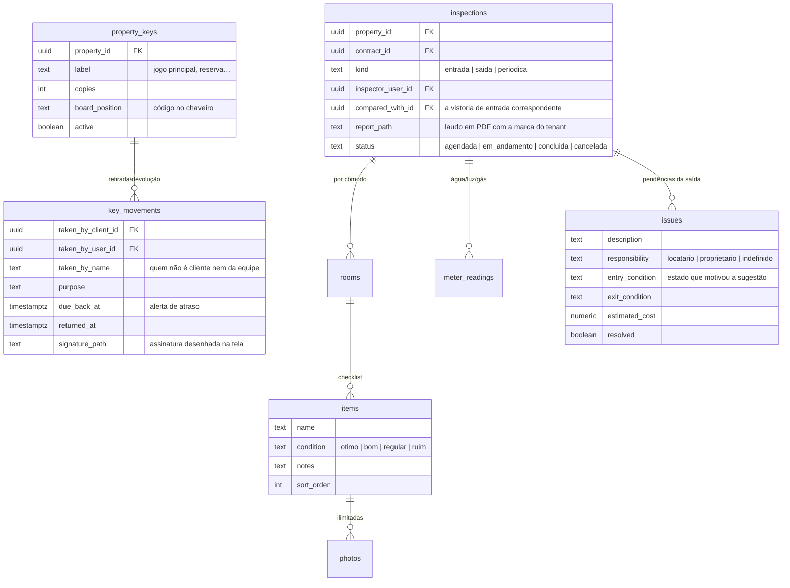
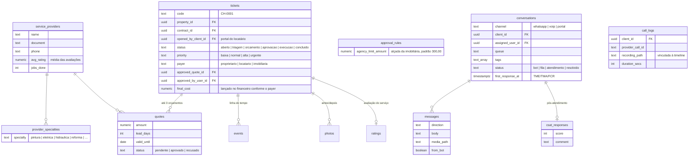
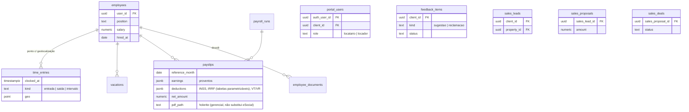

# Modelo de Dados — Diagrama ER (proposta para aprovação)

Schemas separados no Postgres, todos com `tenant_id UUID NOT NULL` + RLS (exceto tabelas globais marcadas). Colunas padrão omitidas dos diagramas por brevidade: `id UUID PK`, `tenant_id`, `created_at`, `updated_at`, `created_by`.

Convenção: nomes de tabela em inglês (padrão do setor de software), rótulos da interface 100% em pt-BR.

---

## Schema `core` — tenants, usuários, RBAC, branding

---

## Schema `crm` — clientes, papéis, timeline, funis

---

## Schema `properties` — imóveis, fotos, proprietários

> Publicação (migration 0010): `properties.properties` ganhou `slug`,
> `publish_site`/`publish_portals`/`is_exclusive`/`published_at`,
> `address_visibility` (completo/rua/bairro, = displayAddress do VRSync) e os
> campos de anúncio `usage_type`, `year_built`, `floors`, `unit_floor`,
> `lot_area`, `rental_warranties`. Somaram-se `properties.portal_publications`
> (rastreio por canal ZAP/VivaReal/OLX/site) e `properties.watermark_settings`
> (marca d'água por tenant e por canal). O controle de publicação é
> independente do `status` operacional.

---

## Schema `rentals` — contratos, cobranças, split, repasses

---

## Schema `finance` — financeiro central

Painel de conciliação = consulta: toda `charge` paga sem `nfse_invoice` autorizada entra na fila de pendências.

---

## Schemas operacionais

> Implementado na Fase 4 (`0009_operations.sql`). Os nomes abaixo são os que
> existem no banco: cada schema tem tabelas curtas (`inspections.rooms`,
> `inspections.items`), sem repetir o schema no nome da tabela.

---

## Observações transversais

- **Dinheiro:** `NUMERIC(14,2)`; percentuais `NUMERIC(7,4)`. Nunca float.
- **Tabelas globais (sem tenant):** `rentals.price_indexes` (IGP-M/IPCA), tabelas de INSS/IRRF parametrizáveis.
- **Storage:** buckets por finalidade (`property-photos`, `documents`, `contracts`, `reports`, `branding`) com caminho prefixado por `tenant_id` e políticas de acesso equivalentes ao RLS.
- **Índices:** todo FK + `(tenant_id, status)` nas tabelas de fluxo (leads, charges, tickets, conversations).
- **NPS/CSAT, indicadores de atendimento e health score** são derivados (views materializadas) — não duplicam dado bruto.
